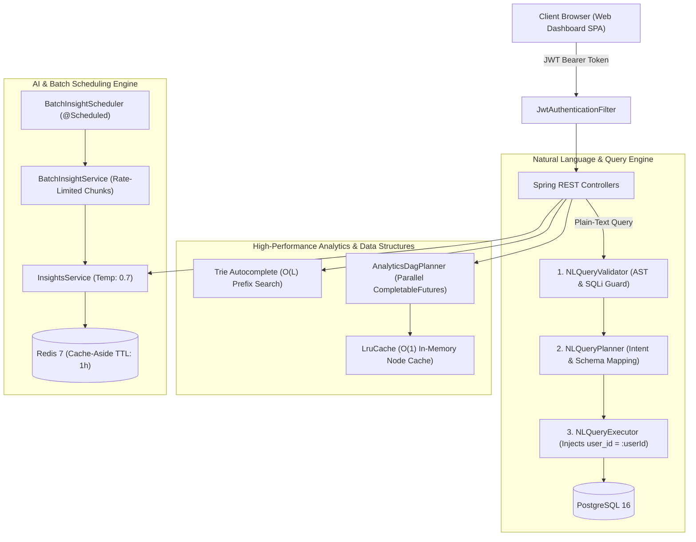

# Expense Tracker — AI-Powered Natural Language Expense Tracker

## 1. Executive Summary & Pitch (For Placement Interviews 🎯)
> **Elevator Pitch**:
> *"I designed and built **Expense Tracker**, a production-ready, multi-tenant financial tracking platform powered by Spring Boot 3, PostgreSQL, Redis, and Generative AI. The system allows users to log expenses using free-form natural language (e.g., 'spent 450 bucks on Dominos pizza yesterday') parsed deterministically via LLM (temperature: 0.0) with temporal anchoring.
> To ensure high performance and security at scale, I engineered a **Validator-Planner-Executor AST pipeline** that translates natural language spending queries into safe, tenant-isolated SQL, an **in-memory O(1) LRU cache** paired with a **DAG analytics planner** for concurrent multi-metric evaluations, a **Trie-based text autocomplete service** for sub-millisecond merchant suggestions, and a **rate-limited batch insight generator** that bounds LLM API load with graceful failure isolation."*

---

## 2. Direct Resume Bullet Points & Technical Alignment

| # | Resume Bullet Point | Exact Code Implementation & Architecture |
|---|---|---|
| **1** | **Built an AI expense tracker enabling manual & natural-language expense entry, spending analytics, & AI insights.** | [`NLPParsingService`](file:///home/abhishek/Desktop/self/expense-tracker/src/main/java/com/example/expense_tracker/service/NLPParsingService.java) (Temp 0.0 JSON schema parsing), [`InsightsService`](file:///home/abhishek/Desktop/self/expense-tracker/src/main/java/com/example/expense_tracker/service/InsightsService.java) (Redis Cache-Aside TTL 1h), and interactive Single Page Dashboard UI. |
| **2** | **Parsed plain-text spending queries by designing a validator-planner-executor pipeline that converts text into safe SQL.** | 3-stage pipeline in `com.example.expense_tracker.pipeline`: [`NLQueryValidator`](file:///home/abhishek/Desktop/self/expense-tracker/src/main/java/com/example/expense_tracker/pipeline/NLQueryValidator.java) (AST scanner), [`NLQueryPlanner`](file:///home/abhishek/Desktop/self/expense-tracker/src/main/java/com/example/expense_tracker/pipeline/NLQueryPlanner.java) (intent to `QueryPlan`), and [`NLQueryExecutor`](file:///home/abhishek/Desktop/self/expense-tracker/src/main/java/com/example/expense_tracker/pipeline/NLQueryExecutor.java) (parameterized typed JPQL). |
| **3** | **Prevented cross-tenant LLM query exposure, injecting user-scoped SQL predicates & blocking unsafe AST operations.** | Dynamic predicate injection (`e.user.id = :userId`) in `NLQueryExecutor`, non-bypassable tenant isolation at DB layer, and proactive AST blocking of DDL/DML mutation keywords (`DROP`, `DELETE`, `UPDATE`, `;`, `--`). |
| **4** | **Bounded API load by rate-limiting scheduled insight generation to fixed users per batch with graceful failure handling.** | [`BatchInsightService`](file:///home/abhishek/Desktop/self/expense-tracker/src/main/java/com/example/expense_tracker/service/BatchInsightService.java) & [`BatchInsightScheduler`](file:///home/abhishek/Desktop/self/expense-tracker/src/main/java/com/example/expense_tracker/scheduler/BatchInsightScheduler.java) with fixed pagination chunks (20 users/page), 250ms API request throttling, and per-user circuit breaker try-catch failure isolation. |
| **5** | **Improved analytics speed and experience with a DAG planner, O(1) LRU cache, and Trie-based text autocomplete.** | [`AnalyticsDagPlanner`](file:///home/abhishek/Desktop/self/expense-tracker/src/main/java/com/example/expense_tracker/pipeline/AnalyticsDagPlanner.java) (parallel multi-stage graph evaluation), [`LruCache<K,V>`](file:///home/abhishek/Desktop/self/expense-tracker/src/main/java/com/example/expense_tracker/util/LruCache.java) (O(1) HashMap + DoublyLinkedList), and [`Trie`](file:///home/abhishek/Desktop/self/expense-tracker/src/main/java/com/example/expense_tracker/util/Trie.java) + [`AutocompleteService`](file:///home/abhishek/Desktop/self/expense-tracker/src/main/java/com/example/expense_tracker/service/AutocompleteService.java) ($O(L)$ prefix tree). |

---

## 3. Core Architecture & System Flow



---

## 4. Deep Dive into Algorithmic & Design Implementations

### A. Trie Prefix Autocomplete Data Structure
- **Purpose**: Sub-millisecond autocomplete suggestions for merchants (Amazon, Swiggy, Netflix) and categories as users type.
- **Complexity**:
  - **Insertion**: $O(L)$ where $L$ is word length.
  - **Prefix Search**: $O(P + N)$ where $P$ is prefix length and $N$ is total nodes in matching subtree.
  - **Space**: $O(\Sigma \cdot L \cdot N)$ where $\Sigma$ is alphabet size.
- **Design Feature**: Each node tracks a `frequency` integer. Suggestions are ranked by usage frequency so popular merchants appear at the top.

### B. O(1) Thread-Safe LRU Cache
- **Purpose**: Low-latency local memoization of repetitive analytics sub-graphs and natural language query plans before calling Redis.
- **Data Structure**: `HashMap<K, Node<K, V>>` + Sentinel-bounded `DoublyLinkedList`.
- **Operations**:
  - `get(key)`: Looks up node in map, detaches and moves to head in $O(1)$.
  - `put(key, value)`: Updates node or inserts new head. If capacity is exceeded, evicts `tail.prev` in $O(1)$.
- **Thread Safety**: Uses `ReentrantReadWriteLock` to support concurrent reader threads while synchronizing eviction writes.

### C. Directed Acyclic Graph (DAG) Analytics Planner
- **Purpose**: Computes multi-dimensional spending analytics (Totals, Daily Velocity, Category Shares, Payment Mode Breakdowns, Anomaly Spikes) concurrently without redundant database scans.
- **Execution**: Builds a dependency DAG where independent tasks run on thread pools concurrently via `CompletableFuture.supplyAsync` and dependent anomaly detectors aggregate intermediate node outputs via `thenCombineAsync`.

### D. 3-Stage NL-to-SQL Query Pipeline (Validator-Planner-Executor)
- **1. Validator**: Scans raw query tokens against an AST blacklist (`DROP`, `DELETE`, `UPDATE`, `ALTER`, `EXEC`, `--`, `;`). Blocks injection vectors and multi-statement queries immediately.
- **2. Planner**: Extracts temporal window (`startDate`, `endDate`), aggregation target (`SUM`, `AVG`, `COUNT`, `MAX`), category, and vendor constraints into an immutable `QueryPlan` AST.
- **3. Executor**: **Dynamically injects mandatory tenant predicate `WHERE e.user.id = :userId`**. Compiles the plan into a strongly typed parameterized JPQL query with zero string concatenation.

### E. Bounded Batch Insight Scheduler with Rate Limiting
- **Purpose**: Generates daily financial health reports across large user bases without crashing LLM API rate limits.
- **Mechanisms**:
  - **Chunking**: Streams users in fixed pages (`PageRequest.of(page, 20)`) to maintain bounded $O(1)$ memory usage.
  - **Throttling**: 250ms sleep throttle per request guarantees execution stays strictly under upstream LLM rate limits.
  - **Fault Tolerance**: Isolated per-user `try-catch` ensures that an invalid user record or temporary API timeout logs a metric without breaking the batch job.

---

## 5. Complete Production Deployment Guide 🚀

### A. Environment Configuration (`.env`)
Create a `.env` file in the root directory:
```bash
DB_URL=jdbc:postgresql://postgres:5432/expense_tracker
DB_USERNAME=postgres
DB_PASSWORD=your_secure_db_password
REDIS_HOST=redis
REDIS_PORT=6379
JWT_SECRET=c4a896d8e23f4b59b9a6747f3b6118d0e83b9d42d31813150c65f73eab20740e507b815096b14d23c
OPENAI_API_KEY=sk-proj-your-openai-key-here
INSIGHTS_CACHE_TTL_HOURS=1
```

### B. Running with Docker Compose
Run the entire production stack (App + PostgreSQL + Redis) with a single command:
```bash
docker compose up --build -d
```
Verify container health:
```bash
docker compose ps
```

### C. Cloud VPS Deployment (AWS EC2 / DigitalOcean / Linode)
1. **Provision Ubuntu 22.04 / 24.04 LTS Server**.
2. **Install Docker & Docker Compose**:
   ```bash
   sudo apt update && sudo apt install -y docker.io docker-compose-v2
   sudo systemctl enable --now docker
   ```
3. **Clone Repository & Start Services**:
   ```bash
   git clone <repo_url> expense-tracker
   cd expense-tracker
   cp .env.example .env
   # Edit .env with your production credentials
   docker compose up --build -d
   ```

### D. Production Nginx Reverse Proxy with HTTPS & Rate Limiting
Install Nginx and Certbot:
```bash
sudo apt install -y nginx certbot python3-certbot-nginx
```
Configure `/etc/nginx/sites-available/expense-tracker`:
```nginx
# Rate Limiting Zone: 20 requests/second per IP
limit_req_zone $binary_remote_addr zone=api_limit:10m rate=20r/s;

server {
    server_name yourdomain.com;

    location / {
        proxy_pass http://127.0.0.1:8080;
        proxy_set_header Host $host;
        proxy_set_header X-Real-IP $remote_addr;
        proxy_set_header X-Forwarded-For $proxy_add_x_forwarded_for;
        proxy_set_header X-Forwarded-Proto $scheme;

        # Apply Rate Limiting
        limit_req zone=api_limit burst=10 nodelay;

        # Gzip compression
        gzip on;
        gzip_types text/plain text/css application/json application/javascript;
    }
}
```
Obtain free SSL certificate via Let's Encrypt:
```bash
sudo certbot --nginx -d yourdomain.com
```

---

## 6. Placement & Interview Q&A Cheatsheet 💡

### Q1: How does your Validator-Planner-Executor pipeline prevent SQL injection and cross-tenant data leaks?
> **Answer**:
> *"We follow a Defense-in-Depth strategy:
> 1. **Validator Stage**: Scans user query tokens against an AST blacklist. Any DDL/DML keywords (`DROP`, `DELETE`, `UPDATE`), SQL comment delimiters (`--`, `/*`), or multi-statement delimiters (`;`) are rejected before reaching any database engine.
> 2. **Planner Stage**: Converts the query strictly into a safe intermediate representation (`QueryPlan`) with validated allowed fields.
> 3. **Executor Stage**: Dynamically injects the mandatory tenant predicate `WHERE e.user.id = :userId` extracted directly from the verified JWT `SecurityContextHolder`. We use Hibernate Typed Queries with parameterized bindings (`:userId`, `:startDate`), ensuring zero chance of SQL injection or IDOR cross-tenant data exposure."*

### Q2: What is the time and space complexity of your Trie autocomplete?
> **Answer**:
> *"For a query of prefix length $P$:
> - **Time Complexity**: Locating the prefix root takes $O(P)$ time. Collecting top-K suggestions traverses the subtree in $O(N)$ where $N$ is the number of matching candidate nodes. Overall time complexity is $O(P + N)$, making it independent of total database size and near-instant (< 1ms).
> - **Space Complexity**: $O(\Sigma \cdot L \cdot N)$ where $\Sigma$ is the alphabet size, $L$ is average word length, and $N$ is number of stored words."*

### Q3: Why use both an in-memory O(1) LRU Cache and Redis?
> **Answer**:
> *"We utilize a multi-tier caching architecture:
> - **L1 (Local In-Memory LRU Cache)**: Eliminates network roundtrips for repeated query plans and intermediate DAG graph nodes within the same JVM instance (< 0.1ms latency).
> - **L2 (Distributed Redis Cache)**: Provides shared cache persistence across multiple scaled application instances for heavy AI-generated financial insights with a 1-hour TTL."*

### Q4: How do you prevent scheduled jobs from overwhelming LLM rate limits?
> **Answer**:
> *"Our `BatchInsightService` employs three defensive controls:
> 1. **Fixed-Size Chunking**: Queries users using Spring Data pagination (`PageRequest.of(page, 20)`) to maintain steady, bounded heap memory.
> 2. **Token Bucket / Sleep Throttling**: Injects a configurable rate-limit delay (250ms per request) to strictly bound request velocity below third-party API quotas.
> 3. **Error Isolation**: Individual insight runs are isolated in a try-catch circuit breaker block so one user failure or temporary timeout does not abort the remaining batch."*
